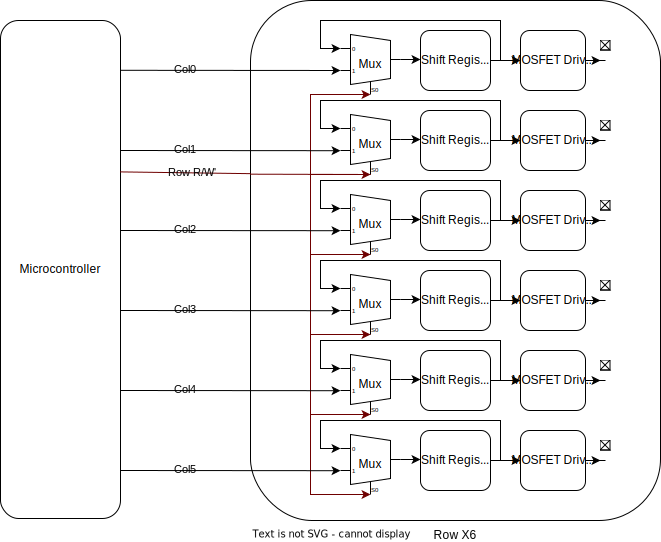

# Phased Array Ultrasonic Transmitter
# Abstract
I built a phased array ultrasonic transmitter. The original plane was also to make a receiver to make a 3D scan, but due to time constraints the receiver was out-of scoped. See [Appendix A](#appendix-a-receiver-notes) for notes on how the receiver should work. The goal was to be able to significantly steer an ultrasonic transmission in two dimensions.

# Table of Contents

# Phased Arrays Backround
Phased arrays are a way to direct to direct the output of individually controlled antennas to point in a certain direction.


#### Figure 1 Phased Array Diagram

To control the direction of the output one can carefully adjust the relative phases of the transmitters such that the peaked of all of the emitted waves align in a certain direction. Essentially this creates constructive interference pattern in the desired direction and varying degrees of destructive interference in all other directions (See [Appendix B](#appendix-b-interference-pattern-of-phased-array) for interference pattern). The simplest case of this is simply having each emitter having the same phase, creating a wave going perpendicular to the array of emitters.

## One Dimensional Phased Array


Define emitter the position n in the line as $p_n $. To create a one dimensional phased array at some angle $\Theta_s$, draw a line perpendicular line to the desired angle through each emitter. Define $L_n$ as the line passing through $p_n $. To calculate the phase delay from $e_m$ to $p_n $, calculate the distance from $e_m$ to $L_n$, at angle $\Theta_s$. Call this distance $x_{m, n}$. If the distance between emitters, m and n is $d_{m,n}$, then:
$$ x_{m,n} = d_{m,n}sin(\Theta_s) $$
To constructively interphase, the peak of the wave must reach the intersection point on $L_n$ exactly when $e_m$ starts emitting the wave. Therefore the phase delay is:
$$\Delta\theta_{m,n} = \frac{2\pi x_{m, n}}{\lambda}$$
Where $\lambda$ is the wavelength of the emitted wave.
Therefore 
$$\Delta\theta_{m,n} = \frac{2\pi d_{m,n}sin(\Theta_s)}{\lambda}$$

## Two dimensional Phased Arrays
For a two dimensional array, the idea is the same, except instead of creating a line $L_n$, create a plane that is normal to the desired emission direction. Then calculate the distance from each emitter to that plane.


If the desired direction is defined in terms of  ($\theta$, $\phi$). Then a plane going through $(0,0,0)$ is defined as:
$$ 0 = sin(\theta)cos(\phi)x + sin(\theta)sin(\phi)y + cos(\theta) z$$

If there is an emitter at position $p_n=(p_{xn}, p_{yn}, p_{zn})$ Therefore:
$$|x_n| = |sin(\theta)cos(\phi)p_{xn} + sin(\theta)sin(\phi)p_{yn} + cos(\theta)p_{zn}|$$
The phase delay can be calcualted as 
$$\Delta\theta = \frac{2\pi |x_n|}{\lambda}$$

I have made a [visualization of this setup available here](https://www.geogebra.org/3d/fzej5fvj).

# Electronics Design

## Block Diagram
I followed the basic hardware design of another [ultrasonic array](https://doi.org/10.3390/app11072981), this one designed for levatation. They also had limited IO, on the main controller (in this groups case, an FPGA), so devised a system to get ardound this they use a bunch of row addressable shift registers. 

Note that only one row is show, but in the actual design there are 6 rows, each with its oen $R/\bar{W}$ Signal.

## Hardware Description
Depending on the $R/\bar{W}$ value the shift registers can rotationally shift their inputs, or be written through from the microcontroller. The shift registers are clocked using a multiple of the desired clock frequency for my ultrasonic emitters (40kHZ). For example if using 64-bit shift registers, the shift registers should be clocked at $40kHz*64=2.56MhZ$.

Each shift register has a shifted version of 
```
1111111111111111111111111111111100000000000000000000000000000000
```
stored inside it. 
### Table of Examples

| Phase Shift     | Shift Register Contents |
| ----------- | ----------- |
| $\frac{\pi}{32}$ | `0111111111111111111111111111111110000000000000000000000000000000` |
| $\pi$   | `0000000000000000000000000000000011111111111111111111111111111111` |
| $\frac{3\pi}{2}$ | `1111111111111111000000000000000000000000000000001111111111111111` |

## Part Choices

Based on the paper I used [TC4427](https://ww1.microchip.com/downloads/en/DeviceDoc/20001422G.pdf) MOSFET drivers. To allow me to get up to $\frac{\pi}{32}$ I wanted to use 64 bit shift registers. I wanted to be able to prototype on a breadboard, so I used the the [CD4517B](https://www.ti.com/lit/ds/symlink/cd4517b.pdf?ts=1676841314674&ref_url=https%253A%252F%252Fwww.google.com%252F), The only generally available through-hole 64 bit shift register. I chose the [SNHC175](https://www.ti.com/product/SN54HC157) due to its low price, and wide availability in a variety of form factors.

### RP2040
I choose to use the RP2040 microcontroller for this project. This is primarily due to its low cost (~$1), and relatively high speed. The RP2040 also has PIO blocks that allow for clock cycle precise timing, which is essential to my hardware design.

##


# References
- Chetvorno, CC0, via Wikimedia Commons https://commons.wikimedia.org/wiki/File:Phased_array_animation_with_arrow_10frames_371x400px_100ms.gif
- https://www.radartutorial.eu/06.antennas/Phased%20Array%20Antenna.en.html
# Appendix A: Receiver Notes

# Appendix B: Interference Pattern of Phased Array  
