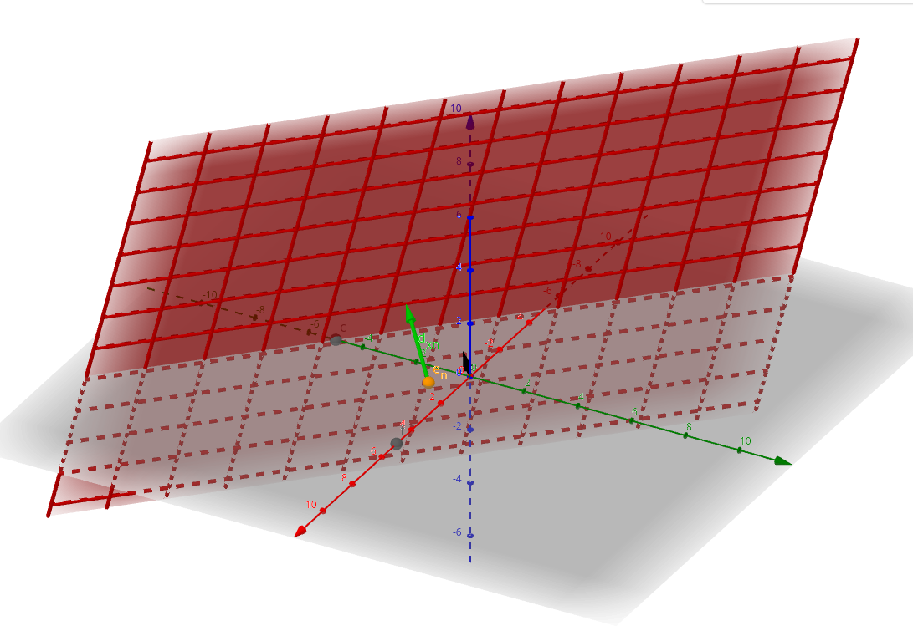

# Phased Array Ultrasonic Transmitter
# Abstract
I built a phased array ultrasonic transmitter. The original plane was also to make a receiver to make a 3D scan, but due to time constraints the receiver was out-of scoped. See [Appendix A](#appendix-a-receiver-notes) for notes on how the receiver should work. The goal was to be able to significantly steer an ultrasonic transmission in two dimensions.

# Table of Contents

# Phased Arrays Backround
Phased arrays are a way to direct to direct the output of individually controlled antennas to point in a certain direction.


#### Figure 1 Phased Array Diagram

To control the direction of the output one can carefully adjust the relative phases of the transmitters such that the peaked of all of the emitted waves align in a certain direction. Essentially this creates constructive interference pattern in the desired direction and varying degrees of destructive interference in all other directions (See [Appendix B](#appendix-b-interference-pattern-of-phased-array) for interference pattern). The simplest case of this is simply having each emitter having the same phase, creating a wave going perpendicular to the array of emitters.

## One Dimensional Phased Array


Define emitter the position n in the line as $p_n $. To create a one dimensional phased array at some angle $\Theta_s$, draw a line perpendicular line to the desired angle through each emitter. Define $L_n$ as the line passing through $p_n $. To calculate the phase delay from $e_m$ to $p_n $, calculate the distance from $e_m$ to $L_n$, at angle $\Theta_s$. Call this distance $x_{m, n}$. If the distance between emitters, m and n is $d_{m,n}$, then:
$$ x_{m,n} = d_{m,n}sin(\Theta_s) $$
To constructively interphase, the peak of the wave must reach the intersection point on $L_n$ exactly when $e_m$ starts emitting the wave. Therefore the phase delay is:
$$\Delta\theta_{m,n} = \frac{2\pi x_{m, n}}{\lambda}$$
Where $\lambda$ is the wavelength of the emitted wave.
Therefore 
$$\Delta\theta_{m,n} = \frac{2\pi d_{m,n}sin(\Theta_s)}{\lambda}$$

## Two dimensional Phased Arrays
For a two dimensional array, the idea is the same, except instead of creating a line $L_n$, create a plane that is normal to the desired emission direction. Then calculate the distance from each emitter to that plane.



If the desired direction is defined in terms of  ($\theta$, $\phi$). Then a normal vector to that plane is:
$$ N = <x_n, \ y_n, \ z_n> = <sin(\theta)cos(\phi), \ sin(\theta)sin(\phi), \ cos(\theta)>$$

In reality, the plane must pass through the emitted that must emit last. This will always be one of the corners of the array. If the corner emitted has coordinates $c=(x_c, y_c, 0)$, then the plane can be defined as

$$ x_nx+ y_ny + z_nz + D = 0$$
Where:
$$ D = -(x_nx_c+y_ny_c) $$

The distance from any point $(x_p, y_p, z_p)$ to this plane is thus:
$$ d_p = |x_nx_p+y_ny_p+z_nz_p+D|$$

It is also useful to define the farthest away corner point $f=(x_f, y_f, z_f)$. Since this emitted needs to be activated first is gets a phase shift of zero. Its distance to the plane is defined as $d_f$. Thus, the time phase shift is:
$$t_{phase \ shift} = d_f - t_e$$
Therefore the angular phase shift $\alpha$ is 
$$\alpha = \frac{2\pi t_{phase \ shift}}{\lambda} $$


I have made a [visualization of this setup available here](https://www.geogebra.org/m/fzej5fvj).

# Electronics Design

## Block Diagram
I followed the basic hardware design of another [ultrasonic array](https://doi.org/10.3390/app11072981), this one designed for levitation. They also had limited IO, on the main controller (in this groups case, an FPGA), so devised a system to get around this they use a bunch of row addressable shift registers. 

Note that only one row is show, but in the actual design there are 6 rows, each with its oen $R/\bar{W}$ Signal.

## Hardware Description
Depending on the $R/\bar{W}$ value the shift registers can rotationally shift their inputs, or be written through from the microcontroller. The shift registers are clocked using a multiple of the desired clock frequency for my ultrasonic emitters (40kHZ). For example if using 64-bit shift registers, the shift registers should be clocked at $40kHz*64=2.56MhZ$.

Each shift register has a shifted version of 
```
1111111111111111111111111111111100000000000000000000000000000000
```
stored inside it. 
### Table of Examples

| Phase Shift      | Shift Register Contents                                            |
| ---------------- | ------------------------------------------------------------------ |
| $\frac{\pi}{32}$ | `0111111111111111111111111111111110000000000000000000000000000000` |
| $\pi$            | `0000000000000000000000000000000011111111111111111111111111111111` |
| $\frac{3\pi}{2}$ | `1111111111111111000000000000000000000000000000001111111111111111` |

## Part Choices

Based on the paper I used [TC4427](https://ww1.microchip.com/downloads/en/DeviceDoc/20001422G.pdf) MOSFET drivers. To allow me to get up to $\frac{\pi}{32}$ I wanted to use 64 bit shift registers. I wanted to be able to prototype on a breadboard, so I used the the [CD4517B](https://www.ti.com/lit/ds/symlink/cd4517b.pdf?ts=1676841314674&ref_url=https%253A%252F%252Fwww.google.com%252F), The only generally available through-hole 64 bit shift register. I chose the [SNHC175](https://www.ti.com/product/SN54HC157) due to its low price, and wide availability in a variety of form factors.

## Ultrasonic Emitted
TODO

### RP2040
I choose to use the RP2040 microcontroller for this project. This is primarily due to its low cost (~$1), and relatively high speed. The RP2040 also has PIO blocks that allow for clock cycle precise timing, which is essential to my hardware design.

### RP2040 PIOs
The RP2040 has 2 programmable IO blocks (PIOs) each of which has four state machines (SMs). These are essentially tiny coprocessors that are terrible for general purpose computing, but designed for time-sensitive IO operations. These state machines run a limited [ISA consisting of 9 instructions](https://datasheets.raspberrypi.com/rp2040/rp2040-datasheet.pdf#instructionSet). Importantly, each instruction takes exactly one clock cycle, and the clock frequency can be set using a divider of the 150MHz system clock. 

To get an ultrasonic response, I need to send out a series of pulses and then stop. While it is relatively easy to send out a continuous series of pulses using clock dividers or the PWM peripheral, the best wat I found to send out a set series of precisely timed pulses was using a PIO SM. To achieve the correct timing, the PIO frequency is set to:

$$f_{pio} = f_{ultrasonic}*n_{steps}*n_{instructions \ per \ step}$$

Here, $n_{steps}$ is the number of bits of the shift register (64), and $n_{instructions \ per \ step}$ is 4 due to [my pio code](https://github.com/abezukor/PhasedArrayUltrasonic/blob/main/3DArray/Software/pulses_pio/pulses.pio#L14). ( The `[1]` indicates one no-op after the instruction). Therefore my PIO clock frequency is:

$$f_{pio} = 40kHz*64*4=10.24MHz$$


To create a set number of pulses, as opposed to a stream of them, my PIO code waits for an input from a hardware fifo, then loops that many times generating a pulse each time. Once its done, it generates an interrupt to let the main code know the pulses have been sent. Afterwards, it waits for another number on the hardware fifo. 

# First Prototype

As a first prototype, I built one row of my circuit on a breadboard. This allowed me to diagnose the circuit and make changes easily. An oscilloscope trace of pulse bounced back is below. I was successfully able to get a noticeable difference when directing the pulse at an angle verses straight ahead. 


# Final Design
After my first prototype, I designed a PCB for one row, with the idea that 6 of them could be combined together to make a 6x6 array. I changed to SMD parts where applicable and ordered them from JLCPCB. KiCAD files are included in the provided files. Unfortunately I made a mistake in my initial PCB order, where the inputs to the column2 and column 6 muxes were swapped, so the PCBs had to be modified to account for this. The included schematic and layout have been updated to fix this issue.


## PCB Verification
To verify that the PCB functions as intended I wrote code that sets each emitter to a phase delay of 2 from the last emitted. Then measured the output of each by using the digital probes on an oscilloscope. Once the issues were solved the traces looked like the following (Showing columns 2, 3, 4 on rows 1, 3, 4, 5):


The phase delay was also measured to verify that everything was functioning properly.
# Outcome
# Code and KiCAD
All the code and KiCAD files are [on this github](https://github.com/abezukor/PhasedArrayUltrasonic).
# References
- Chetvorno, CC0, via Wikimedia Commons https://commons.wikimedia.org/wiki/File:Phased_array_animation_with_arrow_10frames_371x400px_100ms.gif
- https://www.radartutorial.eu/06.antennas/Phased%20Array%20Antenna.en.html
# Appendix A: Receiver Notes

# Appendix B: Interference Pattern of Phased Array  
